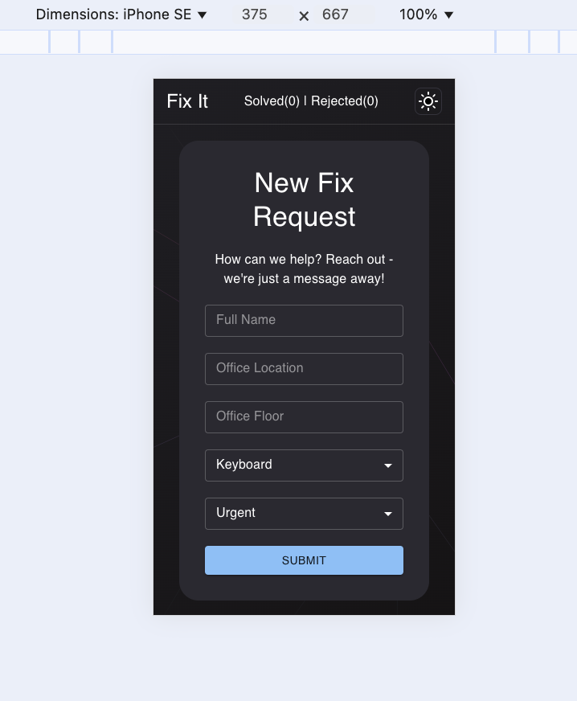

# Fix-It Monorepo

## Website Demo

You can explore the live demo of the application at the following URL: [Fix-It Demo](https://liadmadmon.github.io/fix-it)

## Overview

**Fix-It** is an IT application designed to streamline issue reporting and resolution processes within an organization. The application is built as a monorepo, containing the following packages:

- **Frontend**: The user interface where users can submit their requests.
- **Backend**: The server-side logic that processes incoming requests and manages responses.
- **FSM (Finite State Machine)**: A library for managing the states and transitions of the application.
- **Shared Types**: TypeScript types that are shared across the packages to ensure type safety and consistency.

### Application Functionality

The application allows users to fill out a request form with the following details:
- Name
- Office Floor
- Office Location
- Issue Type
- Urgency Level

Once submitted, the server processes the request and can respond with either "done" or "rejected." In case of rejection, an illustrative PNG image is displayed to guide the user.

 <!-- Update the path to your PNG image -->

## FSM Library Overview

The **FSM** (Finite State Machine) library provides a simple and effective way to manage states and transitions within the application. The core API is encapsulated in a single React hook:

### `useCreateFSM`

The `useCreateFSM` hook facilitates the creation of a finite state machine. It allows you to define states, events, and transitions, making it easy to manage application state in a predictable manner.

#### API Example

```typescript
import { useCreateFSM } from './path/to/fsm';

const initialState = 'idle';
const transitions = [
  { fromState: 'idle', event: 'submit', toState: 'processing', callback: () => console.log('Processing...') },
  { fromState: 'processing', event: 'resolve', toState: 'done', callback: () => console.log('Request Done') },
  { fromState: 'processing', event: 'reject', toState: 'rejected', callback: () => console.log('Request Rejected') },
];

const { dispatch, getState } = useCreateFSM(initialState, transitions);

// Example usage
dispatch('submit')
  .then(() => dispatch('resolve'))
  .catch(error => console.error(error));

  ## Website Demo

You can explore the live demo of the application at the following URL: [Fix-It Demo](https://liadmadmon.github.io/fix-it)

## Getting Started

```


<br />

## Getting Started Locally
To set up the project locally, follow these steps:

1. **Install Dependencies**
```bash
pnpm install
```

2. **Start the client**
```bash
pnpm --filter @fix-it/frontend run start
```

## Running Tests
To ensure everything is functioning correctly, run the tests for the frontend and FSM library using the following commands:
```bash
pnpm --filter @fix-it/frontend run test
pnpm --filter @fix-it/fsm run test
```

## Technologies Used

This project incorporates several modern technologies and libraries to enhance functionality and maintainability:

- **Zustand**: State management for sharing the amount of rejected and done requests.
- **React Hook Form**: Form validation and management.
- **pnpm Workspaces**: Workspace management for a monorepo setup.
- **pnpm**: Fast and efficient package manager for module installation.
- **TypeScript**: For type safety and improved developer experience.
- **Vite + Rollup**: Development server and bundler for the frontend.
- **Material UI's ColorScheme**: Support for light/dark mode themes.
- **React Query**: Used as an API calls caching/retrying mechanism.

## Responsiveness

This application is designed to provide a seamless user experience across various devices, ensuring optimal functionality and accessibility. Below are examples of the application's layout on different screen sizes:

- **Mobile View**: The layout is optimized for smaller screens, allowing users to easily navigate and submit requests without any loss of functionality.
  

- **Desktop View**: The application adapts to larger screens, offering a more spacious interface and additional features for enhanced usability.
  
